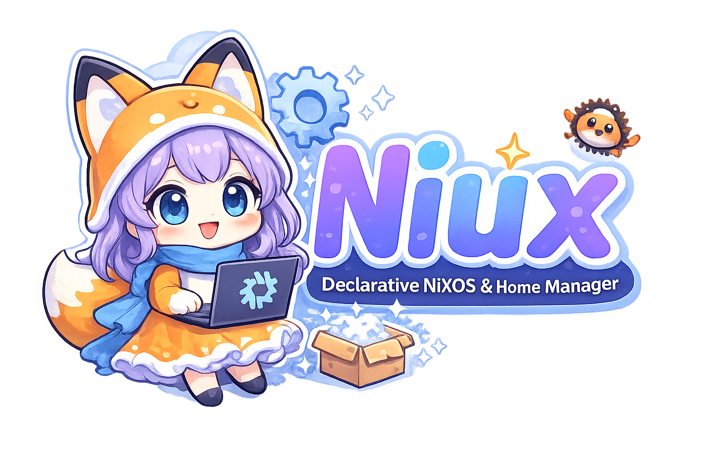

# Niux
**English** | [Русский](./ru/README.md)




Declarative NixOS/home-manager CLI package manager written in Rust.
Tired of editing 'configuration.nix' every time you need a package? Niux lets you manage packages with short commands. 

[](https://github.com/sayavc/niux/releases/latest) 
[](LICENSE) 
[](https://www.rust-lang.org) 
## Why Niux?

Working with `home-manager` and `NixOS` is powerful, but constantly editing configuration files and running `switch` can feel tedious.

**Niux** makes it simple and fast: a lightweight CLI that lets you install, remove, and manage packages **declaratively** with short, intuitive commands — like `apt` or `pacman`, but without breaking Nix's declarative philosophy.

- Install with one command (`niux -Hi firefox`)
- Automatically rebuild configs when needed
- Update flakes, clean up the system, and more
- Built in Rust — fast, reliable, and secure

In short: Niux brings the convenience of traditional package managers to NixOS and home-manager while staying fully declarative.

## Features

- Fast and lightweight command-line interface
- Manage home and system packages declaratively
- Built with Rust for performance and reliability
- Simple and intuitive command syntax
- Supports both standalone and module home-manager
- Supports NixOS with and without flakes

## Requirements
- NixOS

## Installation

## With flakes (home-manager)

Add to your `flake.nix` inputs:

```nix
inputs.niux = {
    url = "github:sayavc/niux";
    inputs.nixpkgs.follows = "nixpkgs";
};
```

Pass niux to home-manager via extraSpecialArgs:

```nix 
homeConfigurations.youruser = home-manager.lib.homeManagerConfiguration {
    pkgs = nixpkgs.legacyPackages.x86_64-linux;
    extraSpecialArgs = { inputs = { inherit niux; }; };
    modules = [ ./home/home.nix ];
};
```

Then add to your home.nix:

```nix
{ inputs, pkgs, ... }: {
    home.packages = [
        inputs.niux.packages.${pkgs.system}.default
    ];
}
```

Run `home-manager switch` to apply.

> **Note:** Non-flake and NixOS module home-manager installation docs coming soon,
> Contributions welcome!

## Configuration

First, generate the default config:
```bash
niux --gen-config
```

Or at a custom path:
```bash
niux --gen-config --default-path-config ~/my/path/niux.kdl
```
To display the path:
```bash
niux --get-current-path
```

> **Note:** `--default-path-config` requires an existing `.kdl` file. Always run `--gen-config` first.

## Usage

### Quick Start
```bash
niux -Hi firefox        # Install firefox for home
niux -Si vim            # Install vim for system

niux -Hr firefox        # Remove firefox from home

niux -Hl                # List home packages
niux -l firefox         # Search everywhere

niux -U                 # Update all flakes
niux -USHa              # Update + rebuild everything

niux -HSa               # Rebuild both configs
```

### Installation & Removal
```bash
niux -Hi firefox            # Install firefox for home
niux -Hia firefox           # Install and rebuild home
niux -Si vim                # Install vim for system
niux -Sia vim               # Install and rebuild system
niux -Hi firefox vim        # Install multiple packages for home
niux -Si firefox vim        # Install multiple packages for system

niux -Hr firefox            # Remove firefox from home
niux -Hra firefox           # Remove and rebuild home
niux -Sr vim                # Remove vim from system
niux -Sra vim               # Remove and rebuild system
niux -Hr firefox vim        # Remove multiple from home
niux -Sr firefox vim        # Remove multiple from system
```

### Listing & Search
```bash
niux -l                     # List all packages
niux -Hl                    # List home packages
niux -Sl                    # List system packages
niux -l firefox             # Search everywhere
niux -Hl firefox            # Search in home
niux -Sl firefox            # Search in system
niux -l firefox vim         # Search multiple
```

### Updates
```bash
niux -U                     # Update all flakes
niux -U nixpkgs             # Update specific flake input
niux -HUa                   # Update + rebuild home
niux -SUa                   # Update + rebuild system
niux -USHa                  # Update + rebuild everything
niux -HUa nixpkgs           # Update nixpkgs + rebuild home
niux -SUa nixpkgs           # Update nixpkgs + rebuild system
```

### Build & Apply
```bash
niux -Ha                    # Rebuild home config
niux -Sa                    # Rebuild system config
niux -HSa                   # Rebuild both configs
```

### Cleanup
```bash
niux --clear                # Run nix-collect-garbage
```

## Commands Reference

| Flag | Description |
|------|-------------|
| `-H, --home` | Target home packages |
| `-S, --system` | Target system packages |
| `-i, --install` | Install packages |
| `-r, --remove` | Remove packages |
| `-a, --apply` | Apply and rebuild configuration |
| `-l, --list` | List or search packages |
| `-U, --update` | Update flakes |
| `--gen-config` | Generate default configuration |
| `--default-path-config` | Use custom config path |
| `--clear` | Run garbage collection |

## Contributing

Contributions are welcome! Please open an issue or submit a pull request.

## License

This project is licensed under the GNU General Public License v3.0 - see the [LICENSE](LICENSE) file for details.

## Author

Created by [sayavc](https://github.com/sayavc)
